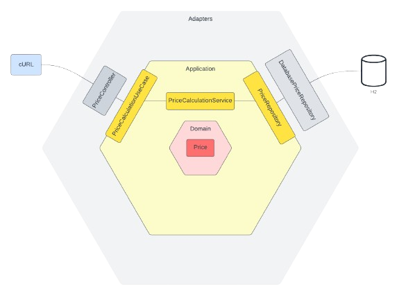

# Pricing Calculator

Service responsible for calculating product prices based on a range of dates.

## Architecture

The project is based on hexagonal architecture, and consists on 4 modules:



1. **boostrap** - Initializes the application and bean container from Spring Framework,
   and setup required configurations.
2. **adapters** - Divided into primary adapters, which use the primary ports to trigger the execution of use cases,
   and secondary adapters, which are called by the use cases.
3. **application** - Represents the business logic, isolated by primary ports, that allows the application
   expose the functionality, and secondary ports, used by the application to reach things outside.
4. **domain** - Core of the application and the business logic, encapsulate its state and behaviour
   being independent of the rest of the modules.
5. **aggregate-report** - Generates an aggregated JaCoCo report from all the modules, which can be used by a linter
   platform like Sonar to analyze the coverage and quality of the current code.

## Get Started
1. Build project: `> mvn clean install`
2. Launch locally: `> mvn spring-boot:run -pl boot`

You can debug it in your preferred IDE running the compiled JAR from `boot` module.


## Usage

API definition can be consulted at `{service_domain}/swagger-ui/index.html#` (i.e. for localhost on the port 8080 
would be [http://localhost:8080/swagger-ui/index.html#](http://localhost:8080/swagger-ui/index.html#))

#### Get Price:

```shell
curl {service_domain}/price?brandId={BRAND}&productId={PRODUCT}&date={DATE}
```
* **BRAND** - Group identifier (1 = ZARA)
* **PRODUCT** - Product code identifier
* **DATE** - Date of application of the price rate


## Design decissions

- An index has been created on the price table, to optimize the queries to the DB.
- The dependency `springdoc-openapi-starter-webmvc-ui` has been used to auto-generate an OpenAPI contract, using 
  Swagger annotations to configure it.
- Spring boot initialization and configuration has been separated to a `boot` module to isolate the specific 
  configuration framework-related.
- A separated module `aggregate-report` has been created to isolate the JaCoCo report generation for every modules.


## Authors

- [Juan Carlos Gonzalez Cabrero](https://www.github.com/malkomich)
